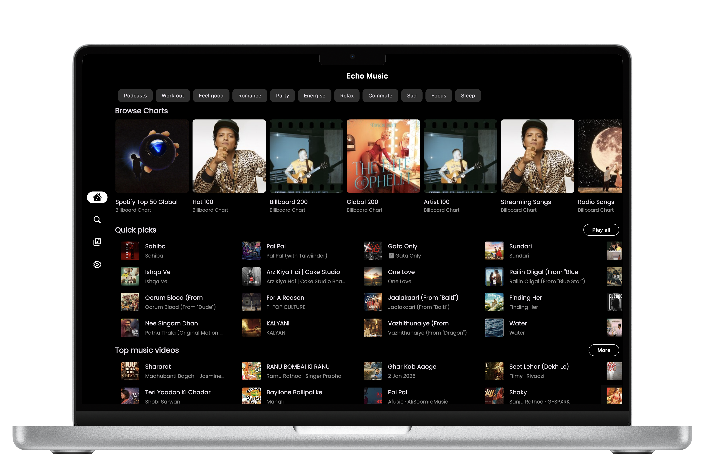
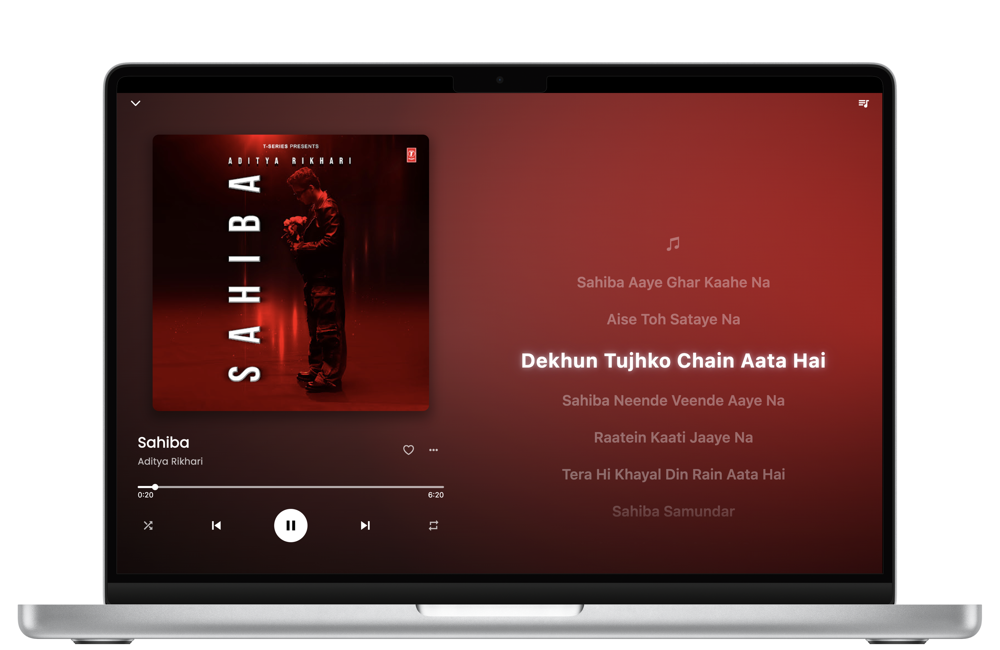
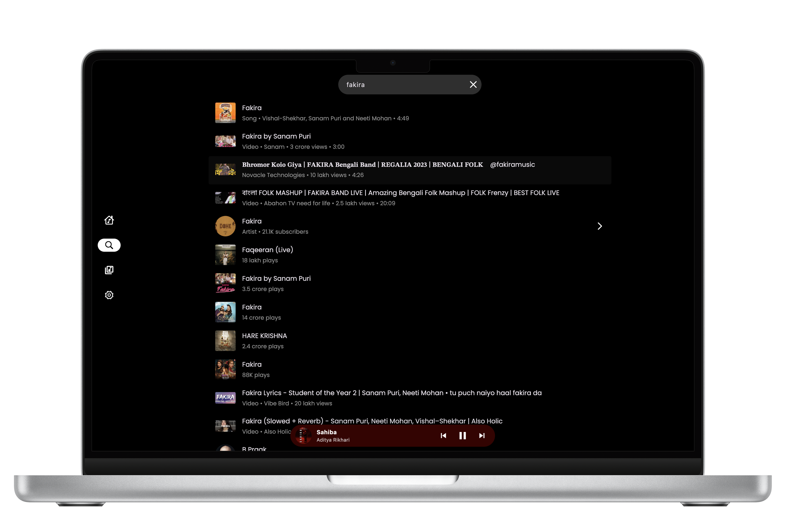
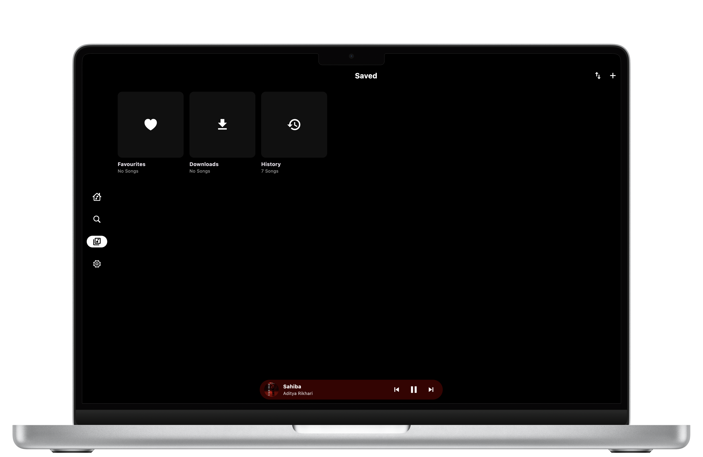

<div align="center">
  

  <h1>NexMusic</h1>

  <p><strong>A robust, open-source music streaming client for Desktop</strong></p>
  <p>Ad-free experience, offline capabilities, and advanced music discovery.</p>

  <br/>

  <a href="https://github.com/nexerisltd/NexMusic-Desktop/releases/latest/download/NexMusic-Desktop-setup.exe" style="text-decoration: none;"></a>&nbsp;
  <a href="https://github.com/nexerisltd/NexMusic-Desktop/releases/latest/download/NexMusic-Desktop.dmg" style="text-decoration: none;"></a>&nbsp;
  <a href="https://github.com/nexerisltd/NexMusic-Desktop#linux" style="text-decoration: none;"></a>
</div>

---

## Overview

NexMusic brings the premium listening experience to your computer. Built with Flutter, it streams from YouTube Music without advertisements and adds powerful desktop-centric features across Windows, macOS, and Linux.

---

## Screenshots

<div align="center">
  
  
  
  
</div>

---

## Features

- **Ad-Free Streaming** — Uninterrupted music playback.
- **High Quality Audio** — Stream in the best available quality.
- **Offline Mode** — Download tracks and playlists for offline listening.
- **Synchronized Lyrics** — Real-time synced lyrics with AI-powered multilingual translation.
- **Cross-Platform** — Supports Windows, macOS, and Linux.
- **Smart Recommendations** — Personalized suggestions based on your listening history.
- **Sleep Timer** — Set automatic playback stop after a chosen duration.

---

## Installation
**Note** (All Platforms): Light Mode currently has layout rendering bugs. It is highly recommended to switch to Dark Mode, the fix is being worked on.

### Windows
1. Download the latest `.exe` installer from the [Releases Page](https://github.com/nexerisltd/NexMusic-Desktop/releases/latest).
2. Run the installer and follow the on-screen prompts.

### macOS
1. Download the `.dmg` file from the [Releases Page](https://github.com/nexerisltd/NexMusic-Desktop/releases/latest).
2. Open the disk image and drag NexMusic to your Applications folder.
3. If you see a security warning, go to **System Settings → Privacy & Security** and allow the app.

### Linux
NexMusic is available as an AppImage, DEB, and RPM package.

1. Download the appropriate package from the [Releases Page](https://github.com/nexerisltd/NexMusic-Desktop/releases/latest).
2. Run or install the downloaded file using the corresponding command below:
    - **AppImage** - Make it executable and run it:
       ```bash
       chmod +x NexMusic*.AppImage && ./NexMusic*.AppImage
       ```
    - **DEB/RPM** - Install via your package manager:
       ```bash
       sudo dpkg -i package.deb
       # or
       sudo rpm -i package.rpm
       ```

---

## Build from Source

Ensure Flutter is installed and configured for desktop development.

1. **Clone the repository**
   ```bash
   git clone https://github.com/nexerisltd/NexMusic-Desktop.git
   cd NexMusic
   ```

2. **Enable desktop support**
   ```bash
   flutter config --enable-windows-desktop
   flutter config --enable-macos-desktop
   flutter config --enable-linux-desktop
   ```

3. **Install dependencies**
   ```bash
   flutter pub get
   ```

4. **Run the app**
   ```bash
   flutter run -d [windows|macos|linux]
   ```

5. **Build for release**
   ```bash
   flutter build [windows|macos|linux]
   ```

---

## Community & Support

Join the community for updates, discussions, and help.

<div align="center">
  <a href="https://discord.gg/P44QdHPtKg"></a>
  &nbsp;
  <a href="https://t.me/nexappog"></a>
</div>

---

## Support the Project

If NexMusic has been useful to you, consider supporting its development.

<div align="center">
  <a href="https://arabiislam.odoo.com/">Visit Arabi Islam's Portfolio</a>
</div>

---

## Special Thanks

NexMusic is built with inspiration and help from these excellent open-source projects:

| Project | Description |
|---------|-------------|
| [Gyawun Music](https://github.com/sheikhhaziq/gyawun_music) | Desktop architecture and UI reference |
| [Echo Music Desktop](https://github.com/EchoMusicApp/Echo-Music-Desktop) | Upstream project this application is based on |

---

## Star History

[](https://www.star-history.com/#nexerisltd/NexMusic-Desktop&type=timeline&logscale&legend=top-left)

---

<div align="center">
  Licensed under <a href="LICENSE">GPL-3.0</a>
</div>
"# NexMusic-Desktop" 
